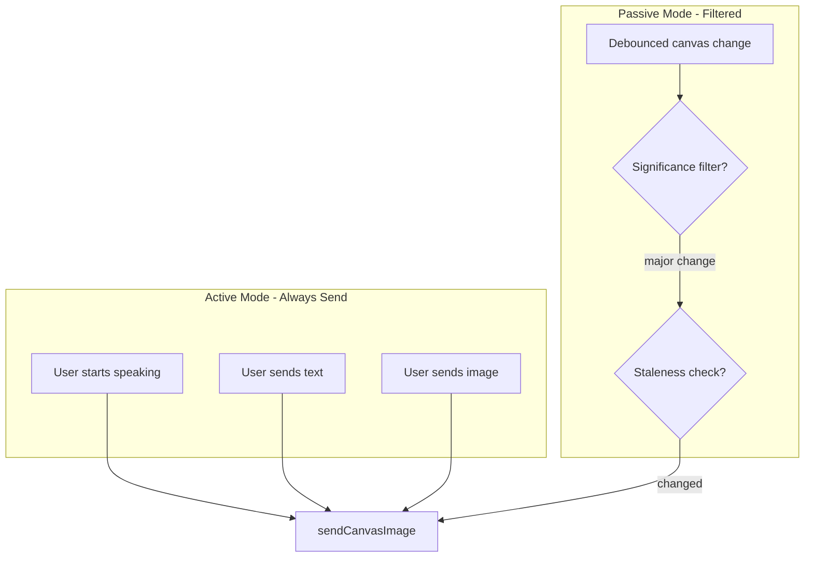
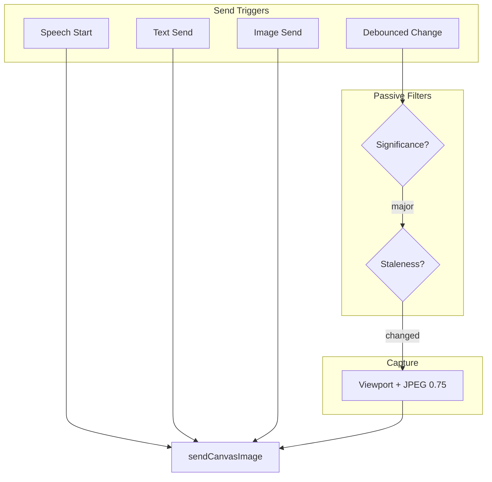

# Realtime Canvas Streaming Report

This document outlines how canvas streaming works in the Lemma Education tutor app: when and how often canvas images are sent to the OpenAI Realtime API, and the optimization strategies employed.

---

## Overview

Canvas streaming sends snapshots of the whiteboard to the tutor so it can see what the student is drawing or working on. Images are sent as context only (no automatic tutor reply). The model uses them when responding to voice, text, or image uploads.

---

## Hybrid Strategy: Active vs Passive Mode

### Active Mode (Send on Interaction)

Canvas is **always** sent when the user explicitly interacts in a way that triggers a tutor response:

| Trigger | When |
|---------|------|
| **Speech start** | User begins speaking (`input_audio_buffer.speech_started`) |
| **Text send** | User submits text or equation |
| **Image send** | User clicks "Get help with this problem" |

These bypass significance filtering and staleness checks.

### Passive Mode (Debounced Change)

When the user edits the canvas without speaking or sending a message, sends are triggered by debounced change detection — but only if the change passes filters.

---

## Optimization Strategies

### 1. Send on Interaction (High Impact)

Instead of sending after every debounce, the primary triggers are user actions that provoke a model response:

- Speech start, text send, image send → always send
- Debounced change → fallback when user draws without interacting

**Impact:** 50–80% fewer images; no loss in quality when it matters.

### 2. Significance Filtering

**File:** `hooks/useCanvasChangeDetection.ts`

Passive mode skips sends for insignificant changes:

- **Skip when:** Exactly 1 shape updated, 0 added, 0 removed (e.g. small position nudge)
- **Send when:** Any shape added, any shape removed, or 2+ shapes updated

**Impact:** 30–60% fewer useless passive updates.

### 3. Viewport-Only Capture

**File:** `components/Canvas.tsx`, `captureViewport()`

- Uses `editor.getViewportPageBounds()` for the visible area
- Uses `editor.getCurrentPageRenderingShapesSorted()` (viewport-culled shapes)
- Passes `bounds: viewportBounds` to `editor.toImage()`

**Impact:** 30–70% token reduction per image vs full-page capture.

### 4. Lower Image Cost (JPEG + Scale)

| Property | Before | After |
|----------|--------|------|
| Format | PNG | JPEG |
| Quality | N/A | 0.75 |
| Scale | 1 | 0.75 |

**Impact:** ~50% smaller payload per image.

### 5. Staleness Check

**File:** `app/tutor/page.tsx`

Before sending in passive mode:

1. Compute a content hash (shape IDs + page bounds, SHA-256 truncated)
2. If `hash === lastSentCanvasHashRef.current`, skip send
3. After successful send, store `hash` in `lastSentCanvasHashRef`
4. Reset `lastSentCanvasHashRef` on disconnect

**Impact:** Avoids duplicate sends when content is unchanged.

---

## Sending Frequency

| Mode | Trigger | Filters |
|------|---------|---------|
| **Active** | Speech start, text send, image send | None |
| **Passive** | 2500 ms debounce after last change | Significance + staleness |

### Passive Mode Flow

1. User edits canvas (add/update/remove shapes)
2. Significance filter: skip if only 1 updated, 0 add/remove
3. Debounce 2500 ms after last qualifying change
4. Staleness check: skip if canvas hash unchanged since last send
5. Capture viewport (JPEG, scale 0.75) and send

---

## Implementation Flow

---

## Components

### 1. Change Detection

**File:** `hooks/useCanvasChangeDetection.ts`

- Subscribes to `editor.store.listen` with `{ source: 'user', scope: 'document' }`
- Significance filter: skips when only 1 updated, 0 add/remove
- Debounces with `debounceMs` (default 2500)
- Calls `onChange` only when `enabled` is true

### 2. Tutor Page Wiring

**File:** `app/tutor/page.tsx`

- `sendCanvasToTutor(forceSend)`: `forceSend=true` for active triggers, `false` for passive
- Active: called from `onSpeechStarted`, `handleTextSend`, `handleSendImageOnly`
- Passive: called from `useCanvasChangeDetection` with staleness check
- Resets `lastSentCanvasHashRef` when `isConnected` becomes false

### 3. Capture

**File:** `components/Canvas.tsx`, `captureViewport()`

- Viewport bounds: `editor.getViewportPageBounds()`
- Shapes: `editor.getCurrentPageRenderingShapesSorted()`
- Options: `format: 'jpeg'`, `quality: 0.75`, `scale: 0.75`
- Returns: `{ base64, mimeType }` for correct API data URL

### 4. Sending to Realtime API

**File:** `hooks/useRealtimeTutor.ts`, `sendCanvasImage(base64, mimeType)`

- Deletes previous canvas item only when `item.id === LEMMA_CANVAS_ITEM_ID` (avoids deleting user uploads)
- Creates new item with `id: "lemma_canvas_context"` and `type: "input_image"`
- Uses `data:image/{format};base64,{base64}` (e.g. `image/jpeg`)
- Does **not** call `response.create` — canvas is context only

---

## Replace Strategy

Only one canvas image is kept in the conversation at a time.

| Step | Action |
|------|--------|
| 1 | If previous canvas item exists, send `conversation.item.delete` |
| 2 | Send `conversation.item.create` with new image and id `lemma_canvas_context` |
| 3 | Store returned item id in `canvasItemIdRef` (only for canvas items, not user uploads) |

---

## Enable / Disable Conditions

Canvas streaming runs only when **all** of these are true:

| Condition | Description |
|-----------|-------------|
| `isConnected` | WebRTC session is active |
| `streamCanvas` | User has "Stream canvas" checkbox enabled |
| `!isPaused` | Session is not paused |

When paused, both microphone and canvas streaming stop. Mute only affects the microphone; canvas continues if stream canvas is on.

---

## User Controls

| Control | Effect |
|--------|--------|
| **Stream canvas** | Checkbox to turn canvas streaming on or off |
| **Pause** | Stops mic and canvas streaming |
| **Resume** | Resumes both (if stream canvas is on) |

---

## Image Format

| Property | Value |
|----------|-------|
| Format | JPEG |
| Quality | 0.75 |
| Scale | 0.75 |
| Capture scope | Visible viewport only |
| Encoding | base64 |
| API format | `data:image/jpeg;base64,{base64}` |

---

## Summary Table

| Aspect | Implementation |
|--------|----------------|
| Send triggers | Speech start, text send, image send, debounced change |
| Active mode | Always send on interaction |
| Passive mode | Significance + staleness filters |
| Debounce | 2500 ms after last qualifying change |
| Capture scope | Visible viewport only |
| Image format | JPEG, quality 0.75, scale 0.75 |
| Max canvas items in context | 1 (replace strategy) |
| Canvas item id | `lemma_canvas_context` |
| Response create on send | No — context only |
| On-speech send | Implemented |
